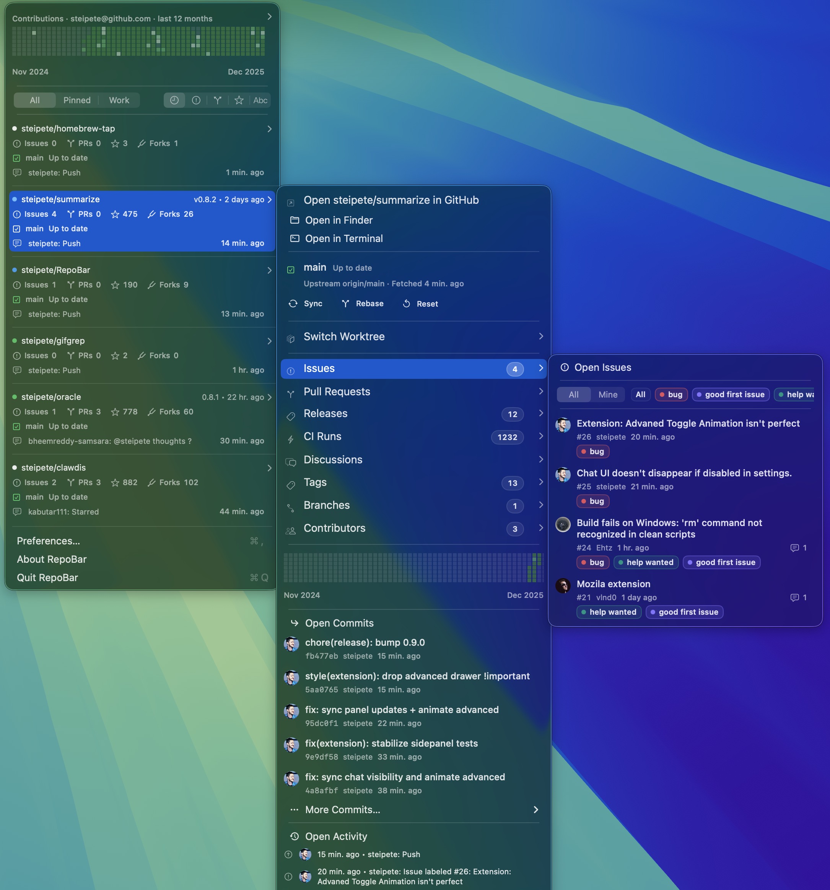

# RepoBar — GitHub at a glance from your menu bar

RepoBar keeps your GitHub work in view without opening a browser. Pin the repos you care about and get a clear, glanceable dashboard for CI, releases, traffic, and activity right from the macOS menu bar.



CI status • Releases • Activity & traffic • Local Git state

Homebrew (recommended):

```bash
brew install --cask steipete/tap/repobar
```

Direct download: [latest release](https://github.com/steipete/RepoBar/releases/latest)

## Features

- Live repo cards with CI status, activity preview, releases, and rate-limit awareness.
- Rich submenus for pull requests, issues, releases, workflow runs, discussions, tags, branches, and commits.
- Global activity feed plus a contribution heatmap header (optional per-repo heatmaps).
- Local Git state in the menu: branch, ahead/behind, dirty files, and worktrees with quick actions.
- Pinned/hidden repos, menu filters, and configurable sorting.
- Fast native UI with caching, layout reuse, and debounced refresh.
- Sparkle auto-updates for signed builds.
- `repobar` CLI for quick listings and JSON/plain output.

Heads up: This is the first public release (v0.1.0). There is still plenty to polish and expand, so expect rough edges and rapid iteration.

## Local projects & sync

Point RepoBar at a local projects folder (e.g. `~/Projects`). It scans the folder, matches repos to GitHub, and shows local branch + sync state right in the menu. Optional auto-sync pulls clean repos using fast-forward only, with a configurable fetch cadence and a notification on successful sync.

## Authentication

RepoBar signs in via browser OAuth and stores tokens securely in the macOS Keychain. It supports both GitHub.com and GitHub Enterprise (HTTPS). No tokens are logged.

## CLI

RepoBar ships a bundled CLI (`repobar`) for quick repo overviews and automation.
Use it for scripts or quick terminal checks that mirror the menu data.
Full command reference: [docs/cli.md](docs/cli.md).

```bash
repobar login
repobar repos --release
repobar repos --release --plain   # no colors, no links, no URLs
repobar repos --release --json    # machine output
```
